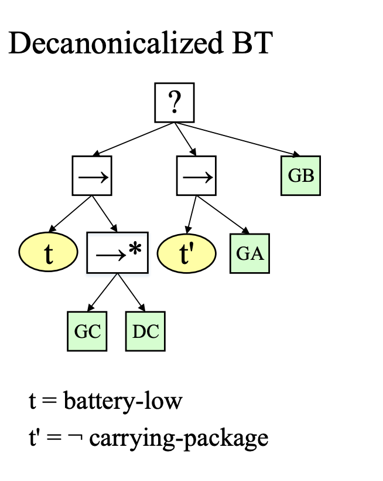

# Behavior-Tree

This program has implemented a domain-independent Behavior Tree model, and executes a tree for a dummy environment for trial purpose.
The dummy environment is presented below:

Details can be found in: http://orca.st.usm.edu/~banerjee/papers/IROS18.pdf

To Run:

1. git clone this repository
2. cd path/to/the/folder
3. mkdir bin
4. make
5. ./bin/main files/BT_Fig8

(Have to give the address to the BT text relative to your position)

